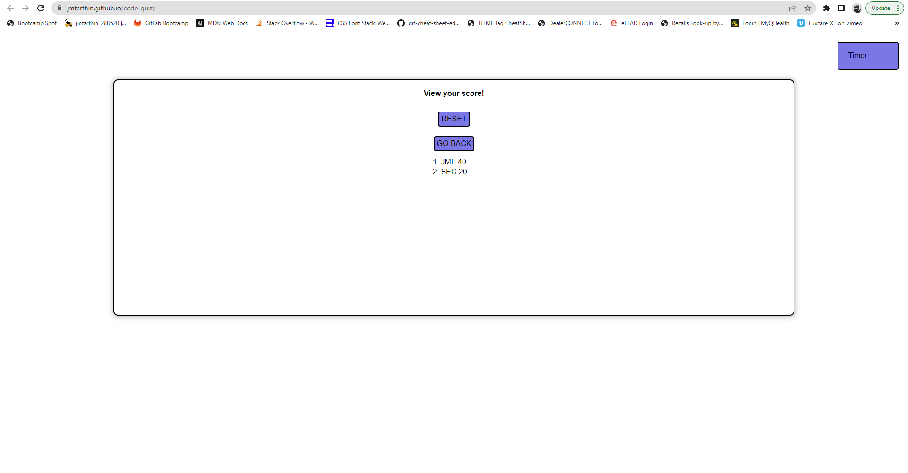

# code-quiz

## Description

This project is the landing page for my portfolio of web development projects to date. It's purpose is to showcase my current knowledge of javascript and highlight certain proficiencies such as:

- web APIs
- timer intervals
- event listeners
- local storage
- traversing the DOM

## Usage

To view Javascript Quiz website, visit: https://jmfarthin.github.io/code-quiz/

Repository: https://github.com/jmfarthin/code-quiz.git

The quiz is useful to determine if you have a basic understanding of Javascript concepts. You can take the quiz by clicking on the 'start' button. Save your score and initials after the quiz is over. You also have the option to reset scores or go back and take the quiz again. Click the 'view high scores' button to review all scores.

### Screenshots of deployed website:

## License

Licensed under the general usage MIT license.
Copyright (c) 2023 Justin Farthing